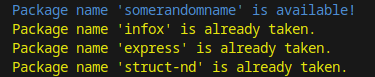
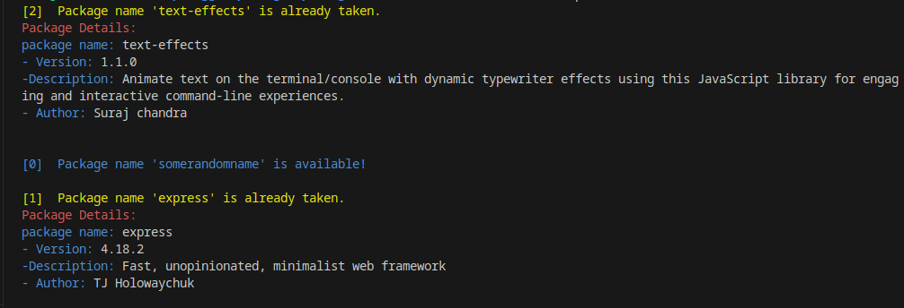

# pkg-avail
`pkg-avail` is a simple command-line tool that allows you to quickly check the availability of a package name on npm without the need for external dependencies.

## Features:
- you can check multiple packages with a single command.
- different colour on console to make more human friendly.
- --verbose mode available to get more information of packages.

## Installation:
- `npm install -g pkg-avail` or `npm install pkg-avail`

## Usage:
- ***default-mode***-
- `check <package-name>` or `check <package-name1> <package-name2> ... as many you want`
- Replace <package-name> , <package-name2>  with the name you want to check for availability.

- ***--verbose mode***-
- `check <package-name> --verbose` or `check <package-name1> <package-name2> --verbose`

## Example 1:
- ***command***-
    ```bash
    check multer
    ```
 - ***output***-
    ```bash
    Package name 'multer' is already taken.
    ```

## Example 2:
- ***command***-
     ```bash
     check somerandomname infox struct-nd express
     ```
- ***output***-
    

## Example 3:
- ***command***-
```bash
    check somerandomname infox express --verbose
```

- ***output***-

    